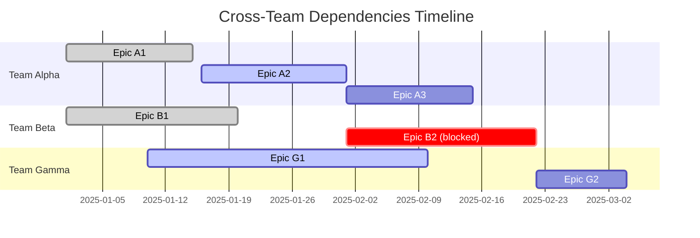

# Product Owner Agent for Outsystems

## Agent Overview

The Product Owner Agent is a specialized AI assistant designed to augment and automate Product Owner responsibilities within the Outsystems Product Development Lifecycle (PDLC). This agent reduces coordination overhead, automates reporting, and provides proactive risk management for multi-team product initiatives.

## Core Capabilities

### 1. Business Requirements ↔ Technical Requirements Translation

Transform high-level business requirements into actionable technical specifications that development teams can immediately implement.

#### Inputs
- Business requirements from JIRA epics/stories
- Product vision documents
- Success metrics and KPIs
- User stories and acceptance criteria

#### Process
1. Parse and analyze business requirements from JIRA
2. Access Outsystems technical documentation via vector database
3. Query codebase explorer agent for technical constraints
4. Generate detailed technical specifications including:
   - API contracts and data models
   - Component architecture requirements
   - Integration points and dependencies
   - Performance and scalability considerations
   - Security requirements

#### Outputs
- Granular JIRA tasks with technical specifications
- Story point estimates based on complexity analysis
- Technical dependency mapping
- Test scenarios and acceptance criteria

### 2. Auto-generated Progress Reports

Generate comprehensive progress reports by analyzing JIRA data, reducing manual reporting overhead from hours to minutes.

#### Report Components

##### Sprint Progress Report
```markdown
# Sprint {number} Progress Report
Generated: {timestamp}

## Executive Summary
- Sprint Predictability: {percentage}%
- Throughput Variance: {percentage}%
- Completion Rate: {completed}/{total} stories

## Team Performance Metrics
- Velocity: {story_points} SP
- Cycle Time: {average_days} days
- Bug Escape Rate: {percentage}%

## Key Achievements
{bulleted_list_of_completed_features}

## Blockers and Risks
{identified_blockers_with_mitigation_strategies}

## Next Sprint Priorities
{upcoming_priorities_based_on_backlog}
```

##### Initiative Status Report
- Progress across all teams (10-15 asset-centric teams)
- Milestone completion tracking
- Budget and resource utilization
- Stakeholder impact assessment

#### Automation Features
- Scheduled report generation (daily/weekly/sprint)
- Auto-attachment to JIRA tasks
- Slack/Teams notifications for critical updates
- Trend analysis and predictive insights

### 3. Risk & Dependency Alerts

Proactive identification and visualization of cross-team dependencies, conflicts, and risks using advanced analysis and visualization tools.

#### Dependency Mapping

##### Mermaid Gantt Chart Generation


##### Risk Assessment Matrix
- **Technical Dependencies**: API readiness, shared components, data models
- **Resource Conflicts**: Team capacity, skill gaps, competing priorities
- **Timeline Risks**: Critical path delays, external dependencies
- **Quality Risks**: Testing bottlenecks, technical debt accumulation

#### Alert Mechanisms
1. **Real-time Notifications**
   - Slack alerts for critical dependency conflicts
   - Email digests for weekly risk summaries
   - JIRA comments on affected tasks

2. **Risk Mitigation Suggestions**
   - Alternative sequencing options
   - Resource reallocation recommendations
   - Parallel workstream opportunities
   - Buffer time adjustments

## JIRA MCP Integration

### Required JIRA Permissions
- Read access to all project epics and stories
- Write access to create and update tasks
- Attachment permissions for reports
- Comment permissions for alerts

### JIRA API Endpoints Used
```yaml
endpoints:
  - GET /rest/api/2/search  # Query issues
  - POST /rest/api/2/issue  # Create tasks
  - PUT /rest/api/2/issue/{issueId}  # Update tasks
  - POST /rest/api/2/issue/{issueId}/attachments  # Add reports
  - POST /rest/api/2/issue/{issueId}/comment  # Add alerts
  - GET /rest/agile/1.0/board/{boardId}/sprint  # Sprint data
  - GET /rest/api/2/issue/{issueId}/transitions  # Workflow states
```

### Custom JIRA Fields Mapping
```json
{
  "technical_specification": "customfield_10001",
  "dependency_links": "customfield_10002",
  "risk_score": "customfield_10003",
  "team_assignment": "customfield_10004",
  "milestone_target": "customfield_10005"
}
```

## Agent Configuration

### Environment Variables
```bash
# JIRA Configuration
JIRA_BASE_URL=https://outsystems.atlassian.net
JIRA_API_TOKEN={encrypted_token}
JIRA_USER_EMAIL={service_account_email}

# Outsystems Context
OUTSYSTEMS_DOCS_URL=https://docs.outsystems.com
OUTSYSTEMS_REPO_PATH=/path/to/codebase
VECTOR_DB_CONNECTION={connection_string}

# Agent Settings
REPORT_GENERATION_SCHEDULE="0 9 * * 1-5"  # Weekdays at 9 AM
RISK_ALERT_THRESHOLD=0.7  # 0-1 scale
DEPENDENCY_SCAN_DEPTH=3  # Levels of dependency tracking
```

### Prompt Templates

#### Business to Technical Translation
```
You are a Product Owner Agent specialized in Outsystems development.
Given the following business requirement:
{business_requirement}

And the following technical context:
- Platform: Outsystems {version}
- Architecture: {architecture_type}
- Existing components: {component_list}

Generate a detailed technical specification that includes:
1. Component breakdown
2. API requirements
3. Data model changes
4. Integration points
5. Performance requirements
6. Security considerations
7. Test scenarios

Format the output as JIRA-compatible markdown.
```

#### Progress Report Generation
```
Analyze the following JIRA data for {sprint_id}:
- Completed tasks: {completed_tasks}
- In-progress tasks: {in_progress_tasks}
- Blocked tasks: {blocked_tasks}
- Comments and updates: {recent_updates}

Generate a comprehensive progress report including:
1. Executive summary with key metrics
2. Team performance analysis
3. Risk identification
4. Recommendations for improvement

Use professional language suitable for stakeholder communication.
```

## Implementation Phases

### Phase 1: MVP (Weeks 1-2)
- [x] JIRA MCP integration setup
- [ ] Basic requirement translation capability
- [ ] Simple progress report generation
- [ ] Manual trigger for all features

### Phase 2: Enhancement (Weeks 3-4)
- [ ] Advanced NLP for requirement parsing
- [ ] Automated report scheduling
- [ ] Basic dependency visualization
- [ ] Slack integration for alerts

### Phase 3: Intelligence (Weeks 5-6)
- [ ] Machine learning for estimation accuracy
- [ ] Predictive risk analysis
- [ ] Cross-team optimization suggestions
- [ ] Feedback loop implementation

## Success Metrics

### Primary KPIs
- **PO Time Reduction**: Target 40% reduction in coordination/reporting time
- **Sprint Predictability**: Achieve ≥80% accuracy in sprint commitments
- **Throughput Variance**: Maintain ≤20% variance across sprints
- **Delivery Deviation**: ≤15% deviation from GA dates

### Secondary Metrics
- **Report Generation Time**: <5 minutes per report
- **Dependency Conflict Detection**: 95% accuracy rate
- **User Adoption Rate**: >75% of POs actively using the agent
- **Feedback Score**: >4.0/5.0 satisfaction rating

## Usage Examples

### Example 1: Breaking Down an Epic
```bash
# Command
po-agent translate-epic EPIC-123

# Output
Created 8 technical stories:
- API-456: Create user authentication endpoint
- UI-457: Implement login component
- DB-458: Design user session schema
- TEST-459: E2E authentication test suite
...
```

### Example 2: Generate Sprint Report
```bash
# Command
po-agent generate-report --sprint 42 --team alpha

# Output
Report generated: SPRINT-42-ALPHA-2025-01-30.md
Attached to JIRA: SPRINT-42
Notified stakeholders via Slack
```

### Example 3: Dependency Alert
```bash
# Alert triggered automatically
⚠️ DEPENDENCY CONFLICT DETECTED
Team Beta's API-789 blocks Team Alpha's UI-456
Impact: 3-day delay to Sprint 43 delivery
Suggested mitigation:
1. Prioritize API-789 completion
2. Implement mock API for UI development
3. Adjust Sprint 43 scope
```

## Error Handling

### Common Scenarios
1. **JIRA Connection Failures**
   - Retry with exponential backoff
   - Cache data locally for offline analysis
   - Alert PO via email if persistent

2. **Incomplete Data**
   - Request missing information via JIRA comments
   - Use historical patterns for estimation
   - Flag assumptions in reports

3. **Conflicting Requirements**
   - Highlight conflicts in technical specs
   - Suggest clarification meetings
   - Create decision tasks in JIRA

## Security Considerations

- All JIRA credentials encrypted at rest
- API tokens rotated monthly
- Audit logs for all agent actions
- Role-based access control for report distribution
- PII data anonymization in reports

## Maintenance and Support

### Monitoring
- Agent uptime and response time
- Report accuracy validation
- User feedback collection
- Error rate tracking

### Updates
- Weekly model fine-tuning based on feedback
- Monthly template optimization
- Quarterly feature releases
- Continuous documentation updates

## Integration with Other Agents

### Codebase Explorer Agent
- Request technical feasibility analysis
- Validate component dependencies
- Check for technical debt impact

### Architecture Review Agent
- Validate technical specifications
- Ensure compliance with standards
- Suggest optimization opportunities

### Testing Automation Agent
- Generate test scenarios from requirements
- Estimate testing effort
- Track test coverage metrics

## Conclusion

The Product Owner Agent represents a significant step toward intelligent automation in product management, specifically tailored for the Outsystems ecosystem. By leveraging JIRA MCP integration and advanced AI capabilities, this agent transforms the PO role from administrative coordination to strategic value delivery.

For support and feedback, contact: supermodular-ai-team@outsystems.com